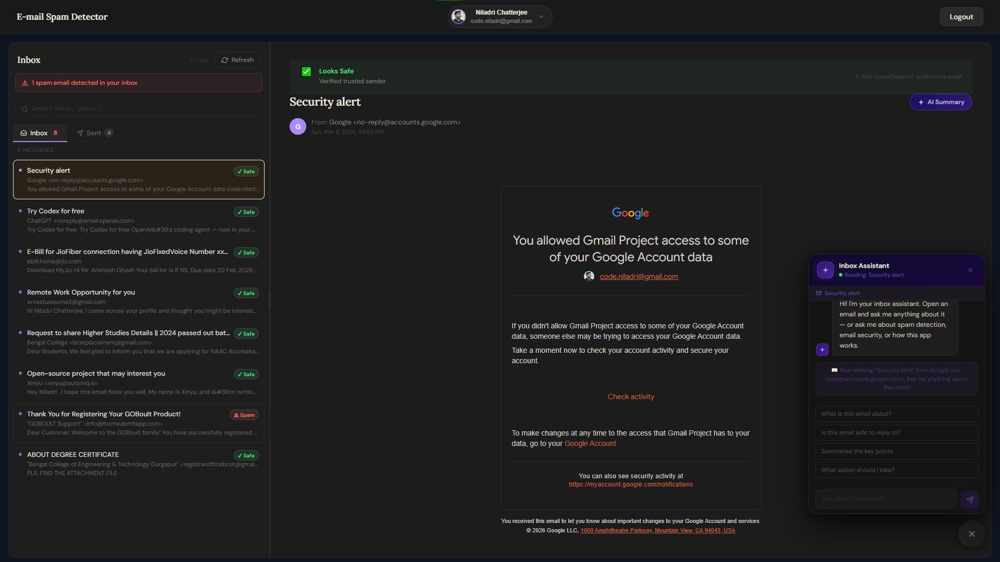

E-Mail Spam Detector
A full-stack Gmail client that detects spam, summarises emails with AI, and provides a context-aware email assistant.

  

 <a href="https://spam-detector1.vercel.app"><strong>Live Website</strong></a> 

Features
Real-time spam detection using trusted domains, suspicious domains/TLDs, keywords, body patterns, and structural signals.

Spam explanations showing why an email was flagged.

AI email summaries powered by Google Gemini.

Context-aware chatbot for questions about the currently opened email.

Inbox analytics with total, safe, spam, scanned counts, spam rate, and top spam signals.

Custom themes and settings including themes, accent colours, font sizes, compact mode, and snippet visibility.

Fast navigation and caching using React Context.

Google OAuth authentication with JWT-based API protection.

Tech Stack
Layer	Technology
Frontend	React 18, Vite
Routing	React Router v6
HTTP Client	Axios
State Management	React Context
Backend	Node.js, Express
Authentication	Google OAuth 2.0, JWT
Database	MongoDB, Mongoose
Email Access	Gmail API
AI	Google Gemini
Deployment	Vercel, Render
Project Structure
EMail-Spam-Detector/
├─ client/
│  ├─ public/
│  ├─ src/
│  │  ├─ components/
│  │  ├─ context/
│  │  ├─ hooks/
│  │  ├─ pages/
│  │  └─ services/
│  └─ package.json
├─ server/
│  ├─ config/
│  ├─ controllers/
│  ├─ middleware/
│  ├─ models/
│  ├─ routes/
│  ├─ services/
│  └─ package.json
├─ .gitignore
└─ README.md
Local Setup
Prerequisites
Node.js v18+

Google account

MongoDB Atlas account

Google Cloud project with Gmail API enabled

Gemini API key

1. Clone the repository
git clone https://github.com/niladri-1/EMail-Spam-Detector.git
cd EMail-Spam-Detector
2. Install dependencies
Backend:

cd server
npm install
Frontend:

cd ../client
npm install
3. Configure Google OAuth
In Google Cloud Console:

Enable the Gmail API and Google People API.

Create an OAuth 2.0 Client ID for a Web application.

Add this development redirect URI:

http://localhost:3000/auth/google/callback
Add your Google account as a test user if the app is in testing mode.

4. Configure backend environment variables
Create server/.env:

PORT=3000
REDIRECT_URI=http://localhost:3000/auth/google/callback
FRONTEND_URI=http://localhost:5173
MONGODB_URI=
MONGODB_NAME=Gmail_User_DB
CLIENT_ID=
CLIENT_SECRET=
JWT_SECRET=
GEMINI_API_KEY=
Generate a JWT secret with:

node -e "console.log(require('crypto').randomBytes(32).toString('hex'))"
5. Configure frontend environment variables
Create client/.env:

VITE_BACKEND_URI=http://localhost:3000
6. Run the application
Backend:

cd server
npm run dev
Frontend:

cd client
npm run dev
Open:

http://localhost:5173
Main API Routes
Method	Route	Description
GET	/auth/google	Start Google sign-in
GET	/auth/google/callback	Handle OAuth callback
GET	/auth/me	Get authenticated user
GET	/emails	Fetch Gmail messages
POST	/emails/scan	Scan emails for spam
POST	/emails/summarise	Generate an AI summary
POST	/chat	Chat with optional email context
Privacy
Email content is not stored in MongoDB.

Emails are fetched from Gmail and processed in memory.

MongoDB stores user profile and login-related information only.

AI features send only the relevant email text to Gemini through the backend.

API keys and secrets should remain in .env files and must not be committed to GitHub.

Deployment
Frontend: Vercel

Backend: Render

Database: MongoDB Atlas

For production, update the frontend/backend URLs and add the production OAuth redirect URI in Google Cloud Console.

Built With
React · Vite · Express · MongoDB Atlas · Gmail API · Google Gemini · Vercel · Render